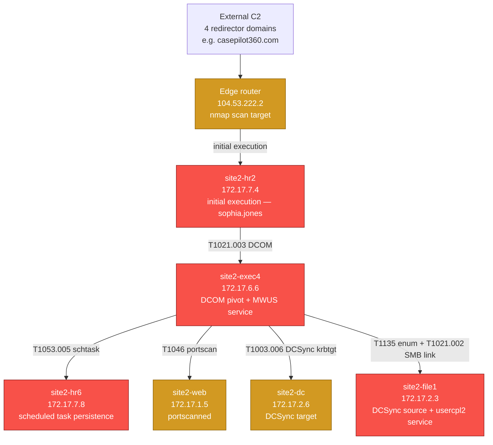

# Site2 Network — 2026-07-13/14 Attack Path

Topology and attack path for the Magnolia Sunset Site2 intrusion, derived from the
MSEL timeline in `iocs.py`. Renders automatically on GitHub.

**Legend:** red = compromised host, amber = scanned/targeted only (no confirmed code execution).

## Subnets

| Subnet | CIDR (assumed /24) | Hosts |
|---|---|---|
| HR | 172.17.7.0/24 | site2-hr2 (172.17.7.4), site2-hr6 (172.17.7.8) |
| Exec | 172.17.6.0/24 | site2-exec4 (172.17.6.6) |
| File/DC | 172.17.2.0/24 | site2-file1 (172.17.2.3), site2-dc (172.17.2.6) |
| Web | 172.17.1.0/24 | site2-web (172.17.1.5) |
| External | — | Edge router (104.53.222.2) |

CIDR boundaries are inferred from the third octet grouping the hosts share (172.17.7.x,
172.17.6.x, 172.17.2.x, 172.17.1.x) — confirm against the actual range subnet masks if
you have them; this diagram doesn't assume anything beyond what's in the MSEL timeline.
