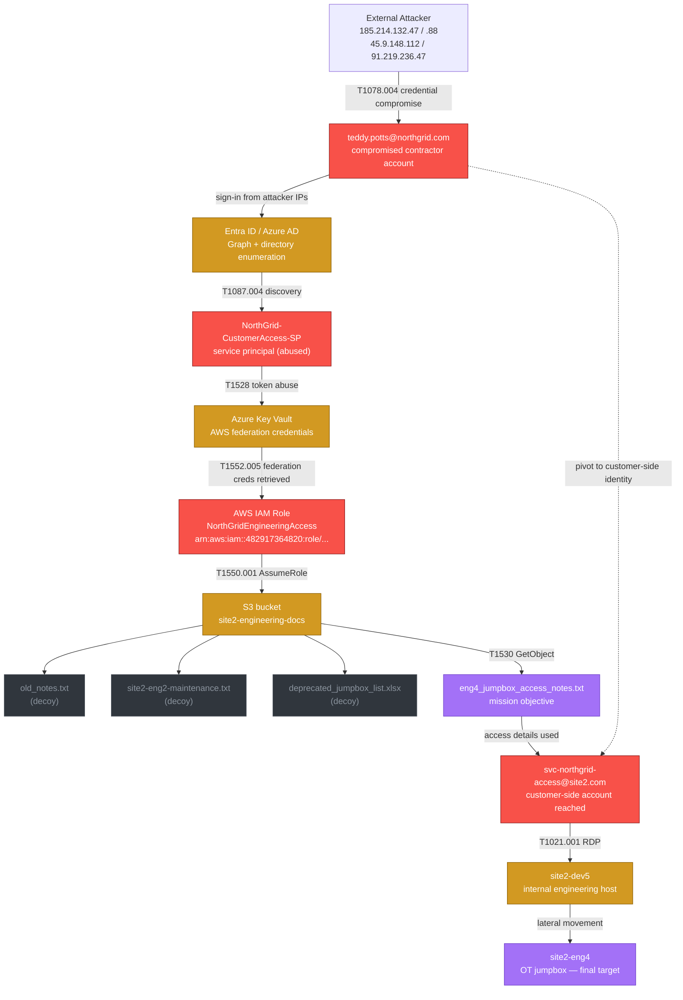

# NorthGrid Cloud Pivot — Azure-to-AWS-to-Site2 Attack Path

Identity/resource pivot path for the NorthGrid Cloud Pivot Assessment Guide scenario,
derived from `sentinel_iocs.py`. A compromised third-party contractor account is used
to ride trusted cloud access from Azure into AWS, ultimately reaching internal
engineering hosts. Renders automatically on GitHub.

**Legend:** red = compromised identity/principal, amber = pivoted-through Azure/AWS
resource, gray = decoy file (dead end), purple = true objective (target file and
final host).

## Identity & resource map

| Stage | Entity | Role in the attack |
|---|---|---|
| Initial access | teddy.potts@northgrid.com | Compromised NorthGrid contractor account |
| Azure enumeration | Entra ID / Graph | Directory, service principal, role assignment discovery |
| Credential access | NorthGrid-CustomerAccess-SP | Service principal abused to reach Key Vault |
| Credential access | Azure Key Vault | Source of AWS federation credentials |
| AWS pivot | arn:aws:iam::482917364820:role/NorthGridEngineeringAccess | Role assumed to cross into AWS |
| Collection | s3://site2-engineering-docs | Bucket containing decoys + the real target file |
| Collection (dead ends) | old_notes.txt, site2-eng2-maintenance.txt, deprecated_jumpbox_list.xlsx | Decoy files expected to be opened first |
| Collection (objective) | eng4_jumpbox_access_notes.txt | Real target — contains site2-eng4 access details |
| Pivot identity | svc-northgrid-access@site2.com | Customer-side account reached via the Azure pivot |
| Internal lateral movement | site2-dev5, site2-eng4 | Internal engineering hosts reached via RDP using the discovered access details |

Attacker IPs (185.214.132.47, 185.214.132.88, 45.9.148.112, 91.219.236.47) aren't drawn
as separate nodes per hop — they're the consistent `source.ip`/`CallerIpAddress` across
Phases 1-3 in `sentinel_iocs.py`, useful as a single pivot value across SigninLogs,
AzureActivity, and AWSCloudTrail. This diagram is derived from the assessment guide's
described attack path, not yet validated against live telemetry — see `sentinel_iocs.py`
notes for the real KQL to confirm each hop.
